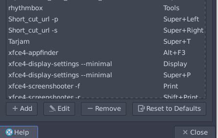

# UrlAutoFire
urlautofire made to make your life easier, this tool allow you to browse a file of urls faster just by adding shortcut to your machine(linux) or send `next` || `prev` to `localhost:1111` 😂😂

## guide 

#### the gui is easy to use but to use the shortcut you must do small configuration to your machine  
1. copy the `.lib/shortcut.py` to `/bin` (`cp /lib/shortcut.py /bin/UATShortcut`)
1. make the file executable (`chmod +x UATShortcut`)
1. go to your menu>settings>keyboard app shortcut (xfce Linux parrot)
1. then add `UATShortcut -s` and your shortcut to represent the next action
1. then add `UATShortcut -p` and your shortcut to represent the previous action

**you might be do another method to set the shortcut it depends on your linux os**.

**note :** the shortcut work only when you active the listener
## requirement 

* [PyQt5](https://pypi.org/project/PyQt5/) : 
   * `pip3 install PyQt5`
* [python3](https://www.python.org/downloads/) 

## demo 

