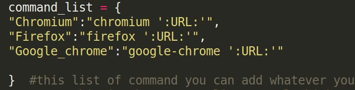
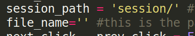
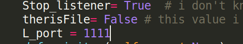

# UrlAutoFire
urlautofire made to make your life easier, this tool allow you to browse a file of urls faster just by adding shortcut to your machine(linux) or send `next` || `prev` to `localhost:1111` 😂😂

## Features
1. **Session management:** when you close the U_A_F or open new file the tool save all current statuts 
1. **Background run :** using the linux shortcut you can make a simple socket connection to make the U_A_F work in background 
1. **Shortcuts :** all button and action work with shortcut just for make your life easier 😂

### NOTE : this version is beta if you have any problem feel free to inform us 

## Guide 

#### The gui is easy to use but to use the shortcut you must do small configuration to your machine  
1. copy the `.lib/shortcut.py` to `/bin` (`cp /lib/shortcut.py /bin/UATShortcut`)
1. make the file executable (`chmod +x UATShortcut`)
1. go to your menu>settings>keyboard app shortcut (xfce Linux parrot)
1. then add `UATShortcut -s` and your shortcut to represent the next action
1. then add `UATShortcut -p` and your shortcut to represent the previous action

**you might be do another method to set the shortcut it depends on your linux os**.

**note :** the shortcut work only when you active the listener
## Requirement 

* [PyQt5](https://pypi.org/project/PyQt5/) : 
   * `pip3 install PyQt5`
* [python3](https://www.python.org/downloads/) 
## Usage 
* **previous button :** to open the previous url (`Ctrl+D`)
* **next button :** to open the next url (`Ctrl+S`)
* **play button :** open selected urls (`Ctrl+P`)  
* **breackpoint button :** to set a list of break points (`Ctrl+B`) ~~same to remove~~
* **listener button :** to start or stop the listenr (listener used when you use the shortcut linux option ) (`Ctrl+L`)
* **list of browsers  :** to shouse which browser will open the urls 
* **filter input :** you can use regex to output only specific urls 
* **file>open :** open your urls_file (`Ctrl+O`)
* **square button:** do nothing just for make the tool look beauty

## Demo 

### Video:

## Advanced configuration

* If you want to add a new browser or custom command just add it to `command_list` LIST with the following syntax `,"command name":"command ':URL:'" the` `:URL:` represent current url 

* If you want to specify a specific session path , then change the value of `session_path` 

* If you want to change the Lport just change the value of `L_port` and change the port in `shortcut.py` to new `L_port` (`1111 to new l_port`) 

